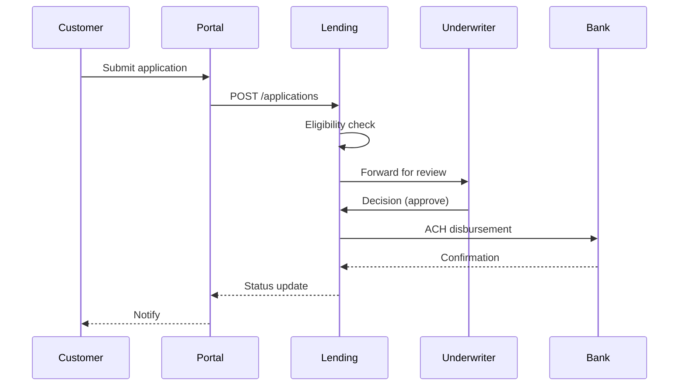

# Business Overview

> AIDLC Inception > Reverse Engineering > Business analysis
> Generated for brownfield project. Reflects current code state as of timestamp in `reverse-engineering-timestamp.md`.

## 1. Business Context

This application is the **internal lending platform** for a financial services company. It supports the end-to-end loan origination lifecycle from application submission through underwriting decision to disbursement and servicing.

**Primary stakeholders**: loan officers (internal), customers (external via portal), risk analysts (internal), finance team (internal).

---

## 2. Business Capabilities

| Capability | Description |
|------------|-------------|
| **Loan Application Intake** | Customer/agent submits loan application with applicant info and amount |
| **Eligibility Screening** | Automated rules engine evaluates basic eligibility (income, credit score) |
| **Underwriting Decision** | Manual + automated underwriting produces approve/decline/needs-info |
| **Disbursement** | Approved loans are disbursed via ACH integration |
| **Servicing** | Payment scheduling, late-payment tracking, payoff calculation |
| **Reporting** | Daily/monthly portfolio reports, regulatory submissions |

---

## 3. Business Transactions

---

## 4. Business Dictionary

| Term | Definition |
|------|-----------|
| **Application** | A loan request submitted by an applicant |
| **Applicant** | The person/entity applying for the loan (may be co-applicants) |
| **Origination** | The full process from application to disbursement |
| **Underwriting** | Risk-based decision to approve/decline the loan |
| **Disbursement** | Transfer of funds to the borrower |
| **Servicing** | Ongoing management of the loan (payments, collections) |
| **DTI** | Debt-to-Income ratio — key underwriting metric |
| **LTV** | Loan-to-Value ratio (for secured loans) |
| **Delinquent** | A loan with one or more missed scheduled payments |

---

## 5. Business Constraints

- **Regulatory**: Subject to TILA, RESPA, FCRA, ECOA (US lending regulations)
- **Data residency**: All customer data must reside in US-EAST-1 region
- **Audit trail**: Every decision must be reproducibly logged with reviewer ID and timestamp
- **Maximum loan size**: $50,000 per applicant (configurable)

---

## 6. Out of Scope (current codebase)

- Secondary market / loan securitization
- Consumer-facing mobile app (separate codebase)
- Fraud detection (handled by external `fraud-platform` service)
