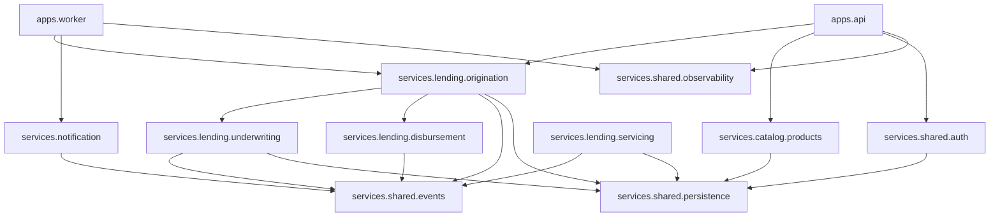

# Dependencies

> AIDLC Inception > Reverse Engineering > Dependency analysis
> Generated for brownfield project.

## 1. Internal Dependency Graph

**Properties**:
- DAG (no cycles)
- Max depth: 3 (api → origination → underwriting → persistence)
- Convergent shared layer (`persistence`, `events`, `obs`, `auth`)

## 2. External Dependencies (Python)

| Package | Version | License | Risk |
|---------|---------|---------|------|
| fastapi | 0.110.x | MIT | Low |
| pydantic | 2.6.x | MIT | Low |
| sqlalchemy | 2.0.x | MIT | Low |
| alembic | 1.13.x | MIT | Low |
| celery | 5.3.x | BSD | Low |
| grpcio | 1.62.x | Apache-2.0 | Low |
| tenacity | 8.2.x | Apache-2.0 | Low |
| structlog | 24.x | Apache-2.0 / MIT | Low |
| opentelemetry-sdk | 1.24.x | Apache-2.0 | Low |
| psycopg | 3.1.x | LGPL-3 | **Medium** — copyleft, review attribution |
| boto3 | 1.34.x | Apache-2.0 | Low |
| confluent-kafka | 2.3.x | Apache-2.0 | Low |
| redis | 5.0.x | MIT | Low |
| pyjwt | 2.8.x | MIT | Low |

## 3. External Dependencies (TypeScript / CDK)

| Package | Version | License | Risk |
|---------|---------|---------|------|
| aws-cdk-lib | 2.130.x | Apache-2.0 | Low |
| constructs | 10.x | Apache-2.0 | Low |
| @aws-cdk/aws-appsync-alpha | 2.x-alpha | Apache-2.0 | **Medium** — alpha API |

## 4. External Services (runtime)

| Service | Dependency type | Failure mode | Mitigation |
|---------|-----------------|--------------|-----------|
| `fraud-platform` (internal HTTP) | Synchronous | Underwriting delays | Circuit breaker + cached fallback |
| `kyc-provider` (3rd party) | Synchronous | Application stuck | Timeout + retry, manual override |
| Stripe ACH (3rd party) | Synchronous | Disbursement failure | Idempotent retry, manual fallback |
| `notification-service` (internal) | Asynchronous (Kafka) | Notifications delayed | Dead-letter queue |

## 5. Dependency Hot-Spots

- **`services.shared.persistence`**: used by 4 services. Changes require coordinated review.
- **`fastapi`**: framework upgrade requires touch-up across all routes.
- **`pydantic` v1 → v2 migration**: completed Q3 2025. No legacy v1 models remain.

## 6. Known Stale / Deprecated

- `flask` (1 instance in `tools/admin_cli.py`) — scheduled for removal Q2 2026
- `@aws-cdk/aws-appsync-alpha` — stable replacement not yet released
